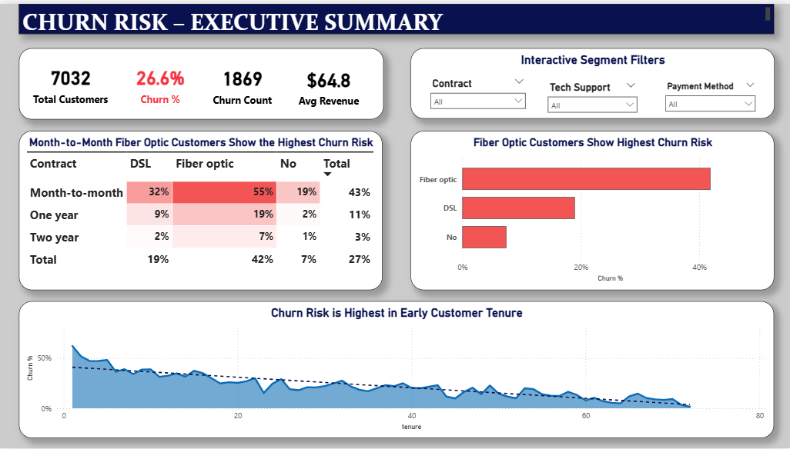
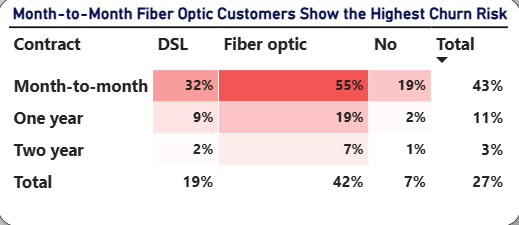
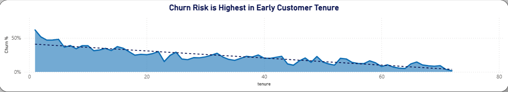

# 📊 Power BI Customer Churn Analysis (Telco Dataset)

---

💡 Project Summary
This Power BI project analyzes Telco customer churn to identify high-risk segments and retention opportunities. Interactive dashboards highlight critical metrics, enabling data-driven business decisions.

---

## 🔍 Project Overview
This project analyzes customer churn for a telecom company to identify **why customers leave, which segments are at highest risk, and where retention strategies should focus**. 

The final deliverable is an executive-style interactive dashboard designed for decision-makers. This project reflects real-world business analytics, focusing on **Diagnostic and Descriptive** insights.

---

## 🎯 Business Objectives
* **Identify High-Risk Segments:** Pinpoint specific demographics and service tiers impacting revenue.
* **Analyze Operational Drivers:** Determine if service types (like Fiber Optic) or contract lengths drive churn.
* **Highlight Retention Opportunities:** Identify the "Safe Zone" and "Danger Zone" to guide marketing spend.

---
## 📂 Project Structure
* [telco_churn_analysis.pbix](./telco_customer_churn.pbix): The main Power BI file.
* [data](./telco_customer_churn_data.csv): Raw and cleaned CSV datasets.
* [images](./images/): High-resolution screenshots used for documentation.
---

## 📊 Dashboard Preview

### 1. Executive Churn Overview
The primary view provides a high-level summary of KPIs, including Total Customers, Churn Rate, and Average Revenue. This view is designed for quick decision-making by highlighting the most critical metrics at the top of the page. 

### 2. Diagnostic Risk Heatmap (The "Deep-Dive")
**Insight:** This Matrix reveals the **"Danger Zone."** Customers on **Month-to-Month** contracts using **Fiber Optic** service show a staggering **55% churn rate**. This represents the highest priority for retention intervention.

### 3. Tenure Trend Analysis (The "Lifecycle") 
**Insight:** Analysis shows that churn risk is highest in the **first 12 months**. This suggests that "onboarding" and "early-stage loyalty programs" are more critical than long-term retention offers.

---

## 🧠 Key Business Questions Answered
* **Where is the revenue leak?** High-monthly-charge customers are churning faster, specifically in the Fiber Optic segment.
* **What is the "Safe Zone"?** Customers with "Two-Year" contracts and "DSL" service have less than 3% churn, regardless of tenure.
* **Who should we target?** New customers (Tenure < 6 months) on Month-to-Month plans are the most critical target for conversion to longer contracts.

---

## 🛠️ Tools & Technologies
* **Power BI Desktop:** End-to-end dashboard design and UI/UX implementation.
* **Power Query:** Data transformation (handling missing values in "Total Charges" and data type standardization).
* **DAX (Data Analysis Expressions):**
    * `Total Customers = COUNT(TelcoData[CustomerID])`
    * `Churn Rate % = DIVIDE([Churn Count], [Total Customers])`
    * `Avg Revenue = AVERAGE(TelcoData[MonthlyCharges])`

---

## 📈 Key Learnings
* **Problem Solving:** Overcame technical tool limitations by utilizing creative visual workarounds (Cards vs. Shapes) to maintain a professional UI.
* **Storytelling:** Shifted focus from "Total Data" to "Actionable Insights," ensuring every chart answers a specific business question.
* **Data Visualization Best Practices:** Applied consistent alignment, white space, and semantic color logic (Red for Churn, Blue for Stability).

---

## 🏁 Conclusion

This project demonstrates the transition from raw data to business intelligence. By identifying the 55% churn rate in the Fiber Optic segment, the business can now implement targeted retention strategies to protect high-value revenue.

